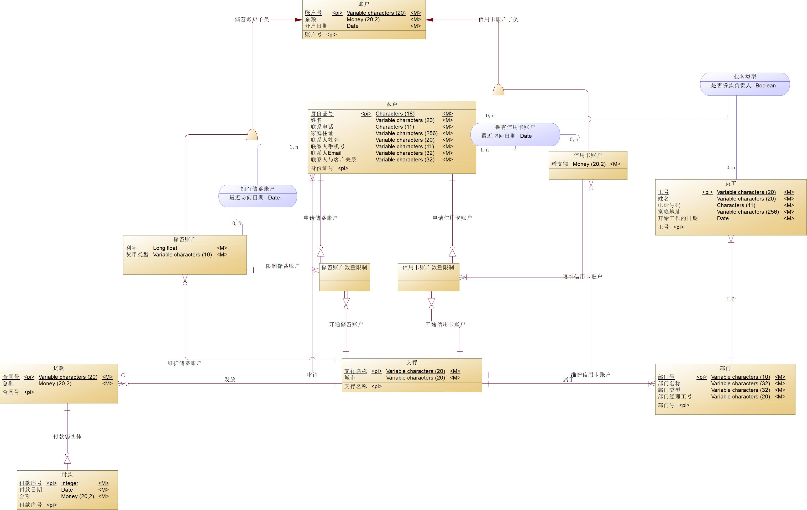
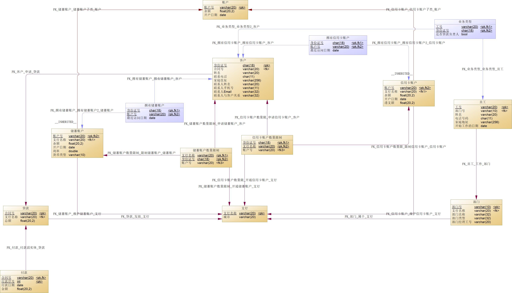

# 
 银行业务管理系统数据库设计 

 <b> PB21111639 李牧龙</b> 

## 概念模型设计
### 实体设计

设计了以下这些实体，加粗的是主码：

- 客户：**身份证号**，姓名，联系电话，家庭地址，联系人姓名，联系人电话，联系人Email，联系人与客户关系
  - 理由：客户是物理存在的实体，且可以通过身份证号唯一标识。
- 支行：**支行名称**，城市
  - 理由：支行是物理存在的实体，且可以通过支行名称唯一标识。
- 部门：**部门号**，部门类型，部门名称，部门经理工号
  - 理由：部门是物理存在的实体，且可以通过部门号唯一标识。另外，按理来说部门经理应该设计成员工的子类，再添加部门经理和部门间的依赖关系，但这样会导致在Power Designer中产生循环依赖，所以这里直接将部门经理工号作为部门的一个属性。
- 员工：**工号**，姓名，电话号码，家庭地址，开始工作的日期
  - 理由：员工是物理存在的实体，且可以通过工号唯一标识。需求中要求存储员工所在部门等信息，但这可以通过员工和部门间的联系关系来实现，所以这里不需要添加部门号属性。
- 账户：**账户号**，余额，开户日期
  - 理由：账户是物理存在的实体，且可以通过账户号唯一标识。
- 储蓄账户：**账户的子类**，有利率，货币类型两个新属性
  - 理由：储蓄账户和信用卡账户都有账户号、余额、开户日期这几项，且账户号不能相同，它们各自还有不同的属性，因此都设计成账户的子类。
- 信用卡账户：**账户的子类**，有透支额这一新属性
  - 理由同上。
- 贷款：**合同号**，总额
  - 贷款是表示抽象概念的实体，且可以通过合同号唯一标识。
- 付款：**贷款下的弱实体**，有**付款序号**，付款日期，金额两个额外属性，其中付款序号是弱实体的分辨符
  - 每一笔付款的存在依赖于贷款，且需要加入贷款的主码才能唯一标识。由于一笔贷款下可以不止一笔付款，每一笔付款应该有自己的分辨符，因此增加了付款序号这一属性。
- 储蓄账户数量限制：同时依赖于客户和支行的弱实体，没有额外属性
  - 需求中要求一位客户在一个支行只能拥有一个储蓄账户，这是一个三元联系，要用二元联系表示必须新增实体，因此增加储蓄账户数量限制这一实体，专门用于表示此联系。
- 信用卡账户数量限制：同时依赖于客户和支行的弱实体，没有额外属性
  - 设计理由同上。
  - 事实上，将这一三元联系在概念模型设计时进行解决会使数据库的设计变得复杂，在实际中可以考虑将其放到数据库上层的应用中加以限制，或是在更新数据库时用存储过程来维护这一限制。这样就可以删除最后两个实体以及与它们相关的所有联系。

### 联系设计：

设计了下列联系：

#### 无属性联系

- 部门 -- (1,n) -- 属于 -- (1,1) -- 支行
  - 理由：一个支行可以有一个或多个部门，而一个部门只能且必须属于一个支行。
- 员工 -- (1,n) -- 工作 -- (1,1) -- 部门
  - 理由：一个部门会有一个或多个员工，一个员工只能且必须工作于一个部门。
- 客户 -- (1,n) -- 申请 -- (0,1) -- 贷款
  - 理由：一位客户最多只能申请一笔贷款，而一笔贷款可以有多位客户共有。
- 支行 -- (1,1) -- 发放 -- (0,n) -- 贷款
  - 理由：一笔贷款在唯一的一个支行办理，而一个支行可以发放0到多笔贷款。
- 支行 -- (1,1) -- 维护储蓄账户 -- (0,n) -- 储蓄账户
  - 理由：一个储蓄账户在一个支行内开设，而一个支行可以有多个储蓄账户（也可以没有）。
- 支行 -- (1,1) -- 维护信用卡账户 -- (0,n) -- 信用卡账户
  - 理由：与上面类似。
- 储蓄账户数量限制 -- (1,n) -- 限制储蓄账户 -- (1,1) -- 储蓄账户
  - 理由：可以将一个“储蓄账户数量限制”实体理解为一位客户在一个支行拥有的储蓄账户记录，因此一个“储蓄账户数量限制”实体只能对应一个储蓄账户（一位客户在一个支行只能由一个储蓄账户），而一个储蓄账户可以由多个客户共有，因此反过来可以有多个（但至少有一个）。
- 信用卡账户数量限制 -- (1,n) -- 限制信用卡账户 -- (1,1) -- 信用卡账户
  - 理由：与上面类似。

#### 有属性联系
- 客户 -- (1,n) -- 拥有储蓄账户 -- (0,n) -- 储蓄账户：最近访问日期
  - 理由：一名客户可以有0到多个储蓄账户，而一个储蓄账户可以由1到多名用户拥有。由于要记录最近访问日期，因此需要设置为有属性联系。
- 客户 -- (1,n) -- 拥有信用卡账户 -- (0,n) -- 信用卡账户：最近访问日期
  - 理由：与上面类似。
- 员工 -- (0,n) -- 业务类型 -- (0,n) -- 客户：是否贷款负责人
  - 一位客户可以由多名员工负责，一名员工也可以负责多名客户。但业务类型只能是负责人或银行帐户负责人，因此用一个布尔值表示即可。

#### 依赖关系
有下面这几个弱实体的依赖关系：

- 付款 -- (0,n) -- 依赖于 -- (1,1) 贷款
- 储蓄账户数量限制 -- (0,n) -- 依赖于 -- (1,1) -- 支行
- 储蓄账户数量限制 -- (0,n) -- 依赖于 -- (1,1) -- 客户
- 信用卡账户数量限制 -- (0,n) -- 依赖于 -- (1,1) -- 支行
- 信用卡账户数量限制 -- (0,n) -- 依赖于 -- (1,1) -- 客户

### Power Designer 的 ER 图

## 概念模型到逻辑模型的转换

### 实体转换
暂时不考虑联系，将实体和弱实体转换为关系：

- 客户（**身份证号**，姓名，联系电话，家庭地址，联系人姓名，联系人电话，联系人Email，联系人与客户关系）
- 支行（**支行名称**，城市）
- 部门（**部门号**，部门类型，部门名称，部门经理工号）
- 员工（**工号**，姓名，电话号码，家庭地址，开始工作的日期）
- 账户（**账户号**，余额，开户日期）
- 储蓄账户（**账户号**，余额，开户日期，利率，货币类型）
- 信用卡账户（**账户号**，余额，开户日期，透支额）
- 贷款（**合同号**，总额）
- 付款（**合同号**，**付款序号**，付款日期，金额）
- 储蓄账户数量限制（**身份证号**，**支行名称**）
- 信用卡账户数量限制（**身份证号**，**支行名称**）

### 联系转换
将联系转换为关系：
- 部门 -- (1,n) -- 属于 -- (1,1) -- 支行
  - 将支行的主码加入部门的属性中
  - 部门（**部门号**，部门类型，部门名称，部门经理工号，支行名称）
- 员工 -- (1,n) -- 工作 -- (1,1) -- 部门
  - 将部门的主码加入员工的属性中
  - 员工（**工号**，姓名，电话号码，家庭地址，开始工作的日期，部门号）
- 客户 -- (1,n) -- 申请 -- (0,1) -- 贷款
  - 将贷款的主码加入客户的属性中
  - 客户（**身份证号**，姓名，联系电话，家庭地址，联系人姓名，联系人电话，联系人Email，联系人与客户关系，合同号）
- 支行 -- (1,1) -- 发放 -- (0,n) -- 贷款
  - 将支行的主码加入贷款的属性中
  - 贷款（**合同号**，总额，支行名称）
- 支行 -- (1,1) -- 维护储蓄账户 -- (0,n) -- 储蓄账户
  - 将支行的主码加入储蓄账户的属性中
  - 储蓄账户（**账户号**，余额，开户日期，利率，货币类型，支行名称）
- 支行 -- (1,1) -- 维护信用卡账户 -- (0,n) -- 信用卡账户
  - 将支行的主码加入信用卡账户的属性中
  - 信用卡账户（**账户号**，余额，开户日期，透支额，支行名称）
- 储蓄账户数量限制 -- (1,n) -- 限制储蓄账户 -- (1,1) -- 储蓄账户
  - 将储蓄账户的主码加入储蓄账户数量限制的属性中
  - 储蓄账户数量限制（**身份证号**，**支行名称**，账户号）
- 信用卡账户数量限制 -- (1,n) -- 限制信用卡账户 -- (1,1) -- 信用卡账户
  - 将信用卡账户的主码加入信用卡账户数量限制的属性中
  - 信用卡账户数量限制（**身份证号**，**支行名称**，账户号）
- 客户 -- (1,n) -- 拥有储蓄账户 -- (0,n) -- 储蓄账户：最近访问日期
  - 新建一个关系模式，将客户和储蓄账户的主码加入其中，再加入最近访问日期
  - 拥有储蓄账户（**身份证号**，**账户号**，最近访问日期）
- 客户 -- (1,n) -- 拥有信用卡账户 -- (0,n) -- 信用卡账户：最近访问日期
  - 新建一个关系模式，将客户和信用卡账户的主码加入其中，再加入最近访问日期
  - 拥有信用卡账户（**身份证号**，**账户号**，最近访问日期）
- 员工 -- (0,n) -- 业务类型 -- (0,n) -- 客户：是否贷款负责人
  - 新建一个关系模式，将员工和客户的主码加入其中，再加入是否贷款负责人
  - 业务类型（**工号**，**身份证号**，是否贷款负责人）

### 最终的关系模式
- 客户（**身份证号**，姓名，联系电话，家庭地址，联系人姓名，联系人电话，联系人Email，联系人与客户关系，合同号）
- 支行（**支行名称**，城市）
- 部门（**部门号**，部门类型，部门名称，部门经理工号，支行名称）
- 员工（**工号**，姓名，电话号码，家庭地址，开始工作的日期，部门号）
- 账户（**账户号**，余额，开户日期）
- 储蓄账户（**账户号**，余额，开户日期，利率，货币类型，支行名称）
- 信用卡账户（**账户号**，余额，开户日期，透支额，支行名称）
- 贷款（**合同号**，总额，支行名称）
- 付款（**合同号**，**付款序号**，付款日期，金额）
- 储蓄账户数量限制（**身份证号**，**支行名称**，账户号）
- 信用卡账户数量限制（**身份证号**，**支行名称**，账户号）
- 拥有储蓄账户（**身份证号**，**账户号**，最近访问日期）
- 拥有信用卡账户（**身份证号**，**账户号**，最近访问日期）
- 业务类型（**工号**，**身份证号**，是否贷款负责人）

## MySQL数据库结构实现
### Power Designer 的 PDM 图

### 数据库表定义

 <b> 支行表 </b> 

|列名|中文含义|类型|允许为空|是否主键|是否外键|
|---|---|---|---|---|---|
|支行名称|支行名称|VARCHAR(20)|否|是|否|
|城市|城市|VARCHAR(20)|否|否|否|

 <b> 员工表 </b> 

|列名|中文含义|类型|允许为空|是否主键|是否外键|
|---|---|---|---|---|---|
|工号|工号|VARCHAR(20)|否|是|否|
|部门号|部门号|VARCHAR(10)|否|否|部门表：部门号|
|姓名|姓名|VARCHAR(20)|否|否|否|
|电话号码|电话号码|CHAR(11)|否|否|否|
|家庭地址|家庭地址|VARCHAR(256)|否|否|否|
|开始工作的日期|开始工作的日期|DATE|否|否|否|

 <b> 部门表 </b> 

|列名|中文含义|类型|允许为空|是否主键|是否外键|
|---|---|---|---|---|---|
|部门号|部门号|VARCHAR(10)|否|是|否|
|支行名称|支行名称|VARCHAR(20)|否|否|支行表：支行名称|
|部门名称|部门名称|VARCHAR(32)|否|否|否|
|部门类型|部门类型|VARCHAR(32)|否|否|否|
|部门经理工号|部门经理工号|VARCHAR(20)|否|否|员工表：工号|

 <b> 贷款表 </b> 

|列名|中文含义|类型|允许为空|是否主键|是否外键|
|---|---|---|---|---|---|
|合同号|合同号|VARCHAR(20)|否|是|否|
|支行名称|支行名称|VARCHAR(20)|否|否|支行表：支行名称|
|总额|总额|FLOAT(20,2)|否|否|否|

 <b> 客户表 </b> 

|列名|中文含义|类型|允许为空|是否主键|是否外键|
|---|---|---|---|---|---|
|身份证号|身份证号|CHAR(18)|否|是|否|
|合同号|合同号|VARCHAR(20)|是|否|贷款表：合同号|
|姓名|姓名|VARCHAR(20)|否|否|否|
|联系电话|联系电话|CHAR(11)|否|否|否|
|家庭地址|家庭地址|VARCHAR(256)|否|否|否|
|联系人姓名|联系人姓名|VARCHAR(20)|否|否|否|
|联系人手机号|联系人手机号|CHAR(11)|否|否|否|
|联系人Email|联系人Email|VARCHAR(32)|否|否|否|
|联系人与客户关系|联系人与客户关系|VARCHAR(32)|否|否|否|

 <b> 付款表 </b> 

|列名|中文含义|类型|允许为空|是否主键|是否外键|
|---|---|---|---|---|---|
|合同号|合同号|VARCHAR(20)|否|是|贷款表：合同号|
|付款序号|付款序号|INT|否|是|否|
|付款日期|付款日期|DATE|否|否|否|
|金额|金额|FLOAT(20,2)|否|否|否|

 <b> 账户表 </b> 

|列名|中文含义|类型|允许为空|是否主键|是否外键|
|---|---|---|---|---|---|
|账户号|账户号|VARCHAR(20)|否|是|否|
|余额|余额|FLOAT(20,2)|否|否|否|
|开户日期|开户日期|DATE|否|否|否|

 <b> 储蓄账户表 </b> 

|列名|中文含义|类型|允许为空|是否主键|是否外键|
|---|---|---|---|---|---|
|账户号|账户号|VARCHAR(20)|否|是|账户表：账户号|
|支行名称|支行名称|VARCHAR(20)|否|否|支行表：支行名称|
|余额|余额|FLOAT(20,2)|否|否|否|
|开户日期|开户日期|DATE|否|否|否|
|利率|利率|FLOAT(20,2)|否|否|否|
|货币类型|货币类型|VARCHAR(32)|否|否|否|

 <b> 信用卡账户表 </b> 

|列名|中文含义|类型|允许为空|是否主键|是否外键|
|---|---|---|---|---|---|
|账户号|账户号|VARCHAR(20)|否|是|账户表：账户号|
|支行名称|支行名称|VARCHAR(20)|否|否|支行表：支行名称|
|余额|余额|FLOAT(20,2)|否|否|否|
|开户日期|开户日期|DATE|否|否|否|
|透支额|透支额|FLOAT(20,2)|否|否|否|

 <b> 储蓄账户数量限制表 </b> 

|列名|中文含义|类型|允许为空|是否主键|是否外键|
|---|---|---|---|---|---|
|身份证号|身份证号|CHAR(18)|否|是|客户表：身份证号|
|支行名称|支行名称|VARCHAR(20)|否|是|支行表：支行名称|
|账户号|账户号|VARCHAR(20)|否|否|储蓄账户表：账户号|

 <b> 信用卡账户数量限制表 </b> 

|列名|中文含义|类型|允许为空|是否主键|是否外键|
|---|---|---|---|---|---|
|身份证号|身份证号|CHAR(18)|否|是|客户表：身份证号|
|支行名称|支行名称|VARCHAR(20)|否|是|支行表：支行名称|
|账户号|账户号|VARCHAR(20)|否|否|信用卡账户表：账户号|

 <b> 拥有储蓄账户表 </b> 

|列名|中文含义|类型|允许为空|是否主键|是否外键|
|---|---|---|---|---|---|
|身份证号|身份证号|CHAR(18)|否|是|客户表：身份证号|
|账户号|账户号|VARCHAR(20)|否|是|储蓄账户表：账户号|
|最近访问日期|最近访问日期|DATE|是|否|否|

 <b> 拥有信用卡账户表 </b> 

|列名|中文含义|类型|允许为空|是否主键|是否外键|
|---|---|---|---|---|---|
|身份证号|身份证号|CHAR(18)|否|是|客户表：身份证号|
|账户号|账户号|VARCHAR(20)|否|是|信用卡账户表：账户号|
|最近访问日期|最近访问日期|DATE|是|否|否|

 <b> 业务类型表 </b> 

|列名|中文含义|类型|允许为空|是否主键|是否外键|
|---|---|---|---|---|---|
|工号|工号|VARCHAR(20)|否|是|员工表：工号|
|身份证号|身份证号|CHAR(18)|否|是|客户表：身份证号|
|是否贷款负责人|是否贷款负责人|TINYINT(1)|否|否|否|

## 总结与体会

- 数据库的设计非常重要，需要将用户的需求转换为具体的数据库设计，非常考验设计者的水平。
- Power Designer 是一个非常好用的数据库设计工具，可以很方便地将ER模型转换为物理模型，同时还可以生成数据库表定义的 SQL 语句。
- 一些复杂关系要直接在数据库中实现会使得数据库变得非常复杂，比如这次实验中一位客户在一个支行最多只能有一个储蓄账户的限制，增加了两个实体和许多外键约束。这样的需求可以通过存储过程等方式在数据库上层实现，这样可以减少数据库的复杂度。