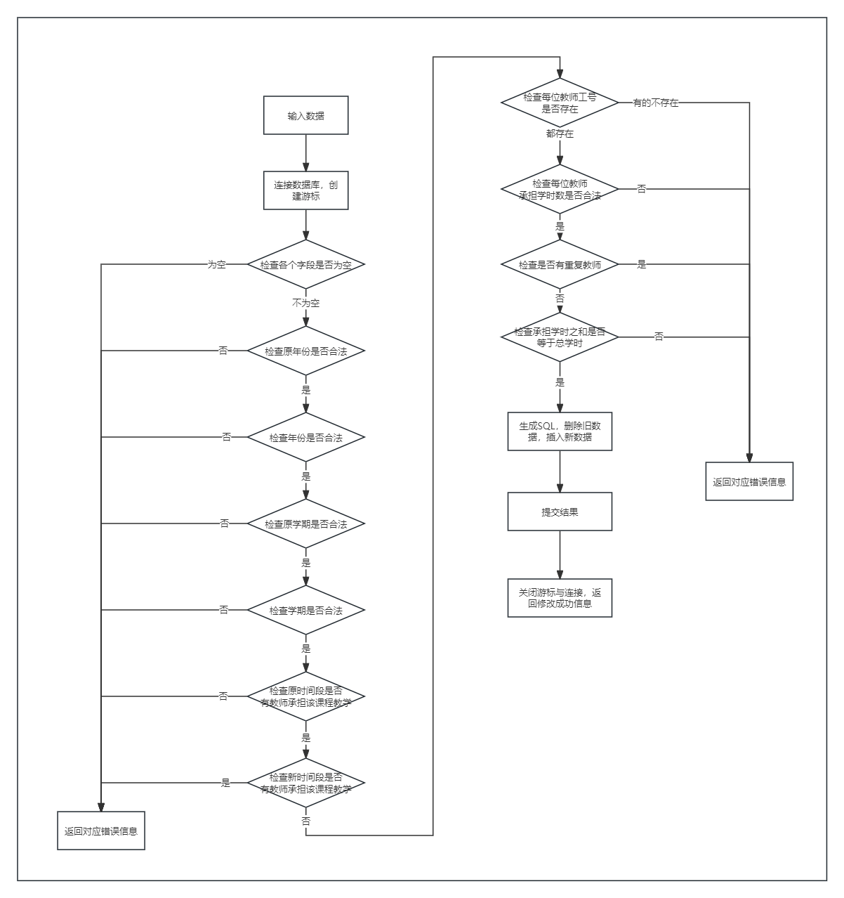
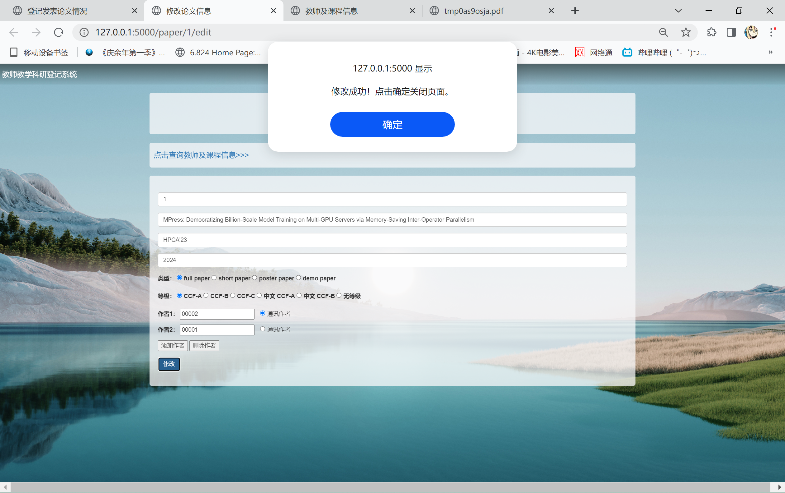

# 
 教师教学科研登记系统 

## 
 系统设计与实现报告 
    

 姓名：李牧龙 
 

 学号：PB21111639 
 

 计算机科学与技术学院 
 

 中国科学技术大学 
 

 2024年6月 
 

# 1 需求分析
## 1.1 系统目标
开发一个面向教师的教学科研登记系统，实现教师的发表论文、承担项目、教学任务、的增删查改功能，同时提供对给定时间段内的教师科研教学工作量的统计功能。

## 1.2 需求说明
1. **论文管理**：提供教师论文发表信息的的增、删、改、查功能；输入时要求检查：一篇论文只能有一位通讯作者，论文的作者排名不能有重复，论文的类型和级别只能在约定的取值集合中选取。
2. **项目管理**：提供教师承担项目信息的增、删、改、查功能；输入时要求检查：排名不能有重复，一个项目中所有教师的承担经费总额应等于项目的总经费，项目类型只能在约定的取值集合中选取。
3. **课程管理**：提供教师主讲课程信息的增、删、改、查功能；输入时要求检查：一门课程所有教师的主讲学时总额应等于课程的总学时，学期。
4. **统计查询**：实现按教师工号和给定年份范围汇总查询该教师的教学科研情况的功能；例如输入工号“01234”，“2023-2023”可以查询 01234 教师在 2023 年度的教学科研工作情况，以及将查询结果导出为pdf。

# 2 总体设计
## 2.1 系统模块结构
架构图如下：
.png>)
系统采用B/S架构设计，用户通过浏览器访问系统。浏览器与Web服务器间交换请求与页面数据，Web服务器通过SQL与数据库交互。系统的主要功能模块均在Web服务器上实现。

### 2.1.1 网页渲染模块
即通常的网页后端，用Python中的Flask框架实现。这一部分接收用户请求，将请求信息提取出来，调用数据库管理模块的接口，获取数据，然后将数据渲染到网页上，返回给用户。返回给前端的页面使用Bootstrap框架进行美化。
另外，为方便用户使用，除实现基本的四部分功能需要的四个页面外，系统还额外提供了查询所有课程和教师信息的页面（这两部分数据不能增删改，只能查询）

### 2.1.2 数据库管理模块
这一模块是网页后端与数据库之间的桥梁，用于处理数据库的增删改查操作。这一模块同样使用Python，通过pymysql库与数据库进行交互。其中有论文模块、项目模块、课程模块、教师模块、统计模块四个子模块，分别处理论文、项目、课程的增删改查操作、教师信息查询和统计查询。

- 论文模块：提供对发表论文信息进行增删查改的接口。
- 项目模块：提供对承担项目信息进行增删查改的接口。
- 课程模块：提供对主讲课程信息进行增删查改的接口，以及查询所有课程信息的接口。
- 教师模块：提供查询所有教师信息的接口。
- 统计模块：提供对教师工号和给定年份范围汇总查询该教师的教学科研情况的接口，以及将查询结果导出为pdf的接口。

## 2.2 系统工作流程
流程图如下：

其中对发表论文、承担项目、主讲课程信息的操作过程非常类似，因此合并到一起。另外，四个模块对应的页面均可以通过链接进入查询所有课程和教师信息的页面，因此也合并到一起。

## 2.3 数据库设计
实验文档中已给出ER图：

最终数据库结构中一共7个表：
教师(<u>工号</u>, 姓名, 性别, 职称)
论文(<u>序号</u>, 论文名称, 发表源, 发表年份, 类型, 级别)
项目(<u>项目号</u>, 项目名称, 项目来源, 项目类型, 总经费, 开始年份, 结束年份)
课程(<u>课程号</u>, 课程名称, 学时数, 课程性质)
发表论文(<u>工号, 序号</u>, 排名, 是否通讯作者)
承担项目(<u>工号, 项目号</u>, 排名, 承担经费)
主讲课程(<u>工号, 课程号, 年份, 学期</u>, 承担学时)
其中带有下划线的是主码。

外键依赖有：
发表论文(工号) -> 教师(工号)
发表论文(序号) -> 论文(序号)
承担项目(工号) -> 教师(工号)
承担项目(项目号) -> 项目(项目号)
主讲课程(工号) -> 教师(工号)
主讲课程(课程号) -> 课程(课程号)

系统中没有使用存储过程、触发器，所有功能均在应用层通过Python实现。

# 3 详细设计
出于方便考虑，流程图中展示步骤顺序可能与实际实现略有不同，但总体流程是一致的。
## 3.1 网页渲染模块
输入：HTTP请求
输出：HTML或JSON数据

## 3.2 发表论文查询模块
输入：论文序号、论文名称、发表源、发表年份、类型、级别、教师工号或姓名（均为可选项）
输出：符合条件的论文信息

## 3.3 发表论文详细信息查询模块
输入：论文序号
输出：论文详细信息

## 3.4 发表论文登记模块
输入：论文序号、论文名称、发表源、发表年份、类型、级别、教师工号、是否通讯作者。其中教师工号和是否通讯作者可以有多组输入，排名即为输入的顺序。
输出：登记成功或失败信息

## 3.5 发表论文修改模块
输入：原论文序号、论文序号、论文名称、发表源、发表年份、类型、级别、教师工号、是否通讯作者。其中教师工号和是否通讯作者可以有多组输入，排名即为输入的顺序。
输出：修改成功或失败信息

## 3.6 发表论文删除模块
输入：论文序号
输出：删除成功或失败信息

## 3.7 承担项目查询模块
输入：项目号、项目名称、项目来源、项目类型、总经费、开始年份、结束年份、负责人工号或姓名（均为可选项）
输出：符合条件的项目信息

## 3.8 承担项目详细信息查询模块
输入：项目号
输出：项目详细信息

## 3.9 承担项目登记模块
输入：项目号、项目名称、项目来源、项目类型、总经费、开始年份、结束年份、负责人工号、承担经费。其中负责人工号可以有多组输入，排名即为输入的顺序。
输出：登记成功或失败信息

## 3.10 承担项目修改模块
输入：原项目号、项目号、项目名称、项目来源、项目类型、总经费、开始年份、结束年份、负责人工号、承担经费。其中负责人工号可以有多组输入，排名即为输入的顺序。
输出：修改成功或失败信息

## 3.11 承担项目删除模块
输入：项目号
输出：删除成功或失败信息

## 3.12 主讲课程查询模块
输入：课程号、课程名称、学时数、课程性质、年份、开课学期、教师工号或姓名（均为可选项）
输出：符合条件的课程信息

## 3.13 主讲课程详细信息查询模块
输入：课程号、年份、学期
输出：课程详细信息

## 3.14 主讲课程登记模块
输入：课程号、年份、学期、教师工号、承担学时，其中教师工号和承担学时可以有多组输入。
输出：登记成功或失败信息

## 3.15 主讲课程修改模块
输入：课程号，原年份，原学期，年份，学期，教师工号，承担学时，其中教师工号和承担学时可以有多组输入。
输出：修改成功或失败信息

## 3.16 主讲课程删除模块
输入：课程号，年份，学期
输出：删除成功或失败信息

## 3.17 统计查询模块
输入：教师工号、开始年份、结束年份
输出：统计查询信息

## 3.18 生成PDF模块
输入：统计查询信息
输出：PDF文件

## 3.19 查询所有教师/课程信息模块
输入：无
输出：所有教师/课程信息

# 4 实现与测试
## 4.1 实现结果
- 主页面

- 论文查询页面

- 论文详情页面

- 论文修改页面

- 论文登记页面

- 项目查询页面

- 项目详情页面

- 项目修改页面

- 项目登记页面

- 课程查询页面

- 课程详情页面

- 课程修改页面

- 课程登记页面

- 统计查询页面

- 全部教师信息查看页面

- 全部课程信息查看页面

## 4.2 测试结果
### 4.2.1 发表论文查询
查询页面提供了多个查找条件，可以填写任意一个或多个条件进行查询，系统会返回同时满足填写的所有条件的结果（对于多选框，则满足其中任意一个）。也可以不填写任何条件，直接点击查询按钮，系统会返回全部结果。
- 输入数据查询

- 查询全部结果

- 点击查看可查看详情

### 4.2.2 发表论文登记
填写登记界面的所有字段即可进行登记（序号可以留空，系统自动选择当前所有序号的最大值+1作为序号）。如果有部分输入数据不合法，则系统会给出提示。否则会成功登记。
- 年份不合法

- 工号不存在

- 成功登记

- 登记后查询

### 4.2.3 发表论文修改
点击编辑，系统会返回修改页面，其中所有字段会自动填写上当前的值，进行修改并提交即可。
这一功能同样有输入检查，如果输入不合法，系统会给出提示。在此不再展示。
- 修改页面

- 成功修改部分信息

- 修改后查询

### 4.2.4 发表论文删除
直接点击删除按钮即可。
- 删除前

- 删除成功

- 删除后

### 4.2.5 承担项目查询
与发表论文查询类似，不再赘述
- 输入数据查询

- 查询全部结果

- 查看详情

### 4.2.6 承担项目登记
与发表论文登记类似，不再赘述
- 经费之和不等于总经费

- 成功登记

- 登记后查询

### 4.2.7 承担项目修改
与发表论文修改类似，不再赘述
- 修改页面

- 成功修改部分信息

- 修改后查询

### 4.2.8 承担项目删除
与发表论文删除类似，不再赘述
- 删除前

- 删除成功

- 删除后

### 4.2.9 主讲课程查询
与发表论文查询类似，不再赘述
- 输入数据查询

- 查询全部结果

- 查看详情

### 4.2.10 主讲课程登记
由于教师数据和课程数据不允许修改，因此这里可以填写的项比较少。同样需要进行输入检查。
- 学时之和不等于总学时

- 成功登记

- 登记后查询

### 4.2.11 主讲课程修改
这里不允许修改课程号。如果要换成另一门课而其余信息不变，那么应该先删除再登记。
- 修改页面

- 成功修改部分信息

- 修改后查询

### 4.2.12 主讲课程删除
与发表论文删除类似，不再赘述
- 删除前

- 删除成功

- 删除后

### 4.2.13 统计查询
输入教师工号和年份范围，点击查询即可。系统会返回该教师在该年份范围内的所有信息，并提供导出pdf的功能。
- 查询结果

- 导出pdf

### 4.2.14 全部教师信息查看
这一功能是为了方便填写信息。不提供增删改功能。
- 教师信息

### 4.2.15 全部课程信息查看
这一功能是为了方便填写信息。不提供增删改功能。
- 课程信息

# 5 总结与讨论
本次实验是计科各类课程实验中少有的独立完成一个功能较为完整、有一定规模的系统的实验。这次实验使我的数据库开发能力得到了提升，对数据库设计、SQL语句的使用有了更深入的了解。采用B/S架构设计系统使得我同时也学到了不少网页开发的知识，对前后端的交互有了更深入的了解。同时，我的Coding能力在本次实验中也得到了提升，对Python和HTML的使用更加熟练。

尽管如此，我仍然建议以后的实验能够做出一些改变。我在完成这一实验时，大部分的时间都花在了编写网页（前端页面和后端响应）上，而数据库（SQL）相关的内容反而没花多少时间（这一点从Github的统计数据也可以看出来，HTML的代码量占了70\%以上）。希望以后的数据库实验能更注重数据库设计和SQL语句的使用，比如可以提供网页（或客户端）部分的代码框架，让大家实现数据库相关部分，同时提高数据库设计和SQL语句的难度，以保持整体工作量不变。